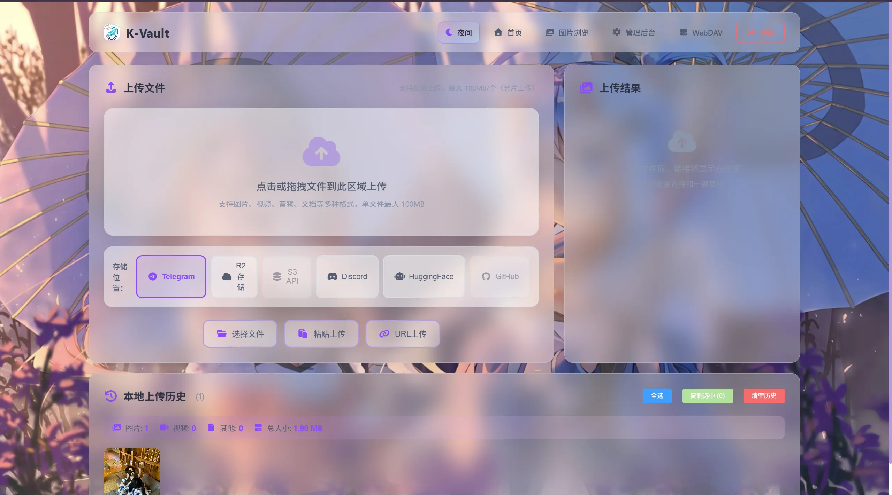

<div align="center">


# K-Vault

> 免费图片/文件托管解决方案，支持 Cloudflare Pages + Docker 双模部署，并兼容多种存储后端

[English](README-EN.md) | **中文**

<br>


</div>

---

## 效果图

<p align="center">
  
  
  
</p>
<p align="center">
  
  
</p>

## 功能特性

- **无限存储** - 不限数量的图片和文件上传
- **完全免费** - 托管于 Cloudflare，免费额度内零成本
- **免费域名** - 使用 `*.pages.dev` 二级域名，也支持自定义域名
- **多存储后端** - 支持 Telegram、Cloudflare R2、S3 兼容存储、Discord、HuggingFace、WebDAV、GitHub
- **Telegram Webhook 回链** - 机器人在频道/群接收文件后自动回复直链
- **KV 写入优化** - Telegram 可启用签名直链，显著降低 KV 读写消耗
- **内容审核** - 可选的图片审核 API，自动屏蔽不良内容
- **多格式支持** - 图片、视频、音频、文档、压缩包等
- **在线预览** - 支持图片、视频、音频、文档（pdf、docx、txt）格式的预览
- **分片上传** - 支持最大 100MB 文件（建议配合 R2/S3/WebDAV/GitHub，Telegram 网页上传按平台限制处理）
- **访客上传** - 可选的访客上传功能，支持文件大小和每日次数限制
- **API Token 认证** - 支持 `curl` / ShareX / 脚本等程序化上传与调用
- **多种视图** - 网格、列表、瀑布流多种管理界面
- **存储分类** - 直观区分不同存储后端的文件
- **双模部署** - 保留 Cloudflare Pages 部署，同时新增 Docker 自托管（`docker compose up -d`）
- **动态存储配置管理** - 支持在管理端通过 API 对存储配置进行新增/编辑/删除/测试/设为默认
- **可插拔设置存储（Docker）** - 基础站点设置可使用 `sqlite`（默认）或 Redis 协议后端（Upstash / Redis / KVrocks）
- **前端路径简化** - 以根路径页面为主流程（`/`、`/admin.html`、`/webdav.html`）
- **GitHub Actions 镜像构建** - 主分支/Tag 自动构建并推送单镜像 `ghcr.io/katelya77/k-vault`


---

## 部署方式

K-Vault 只保留两类正式部署方式：

1. **Cloudflare Pages 部署**：使用 Cloudflare Pages 静态页面 + Pages Functions，适合免费额度、边缘函数、Cloudflare KV/R2 场景。
2. **Docker 部署**：使用单镜像 `ghcr.io/katelya77/k-vault:latest`，适合 VPS/NAS/内网部署，也适合 WebDAV、S3、GitHub、HuggingFace 等多存储后端长期自托管。

两种部署方式使用同一套根目录页面和同一组主入口：

- 上传首页：`/`
- 管理后台：`/admin.html`
- WebDAV 页面：`/webdav.html`
- 管理/API 接口：`/api/*`
- 普通上传：`POST /upload`
- API Token 上传：`/api/v1/upload`
- 文件直链/分享：`/file/*`、`/share/*`、`/s/*`

Docker 版本由 Nginx 在容器内代理到 Node API，对外仍是一个端口，因此用户看到的 UI、管理后台、WebDAV 页面、API Token 上传和多存储配置流程应与 Cloudflare Pages 部署保持一致。

### 方式一：Cloudflare Pages 部署

适合想使用 Cloudflare 免费托管、KV、R2 和 Pages Functions 的用户。

1. **Fork 本仓库**

2. **创建 Pages 项目（推荐 Git 集成）**
   - 登录 [Cloudflare Dashboard](https://dash.cloudflare.com)
   - 进入 `Workers 和 Pages` → `创建应用程序` → `Pages` → `连接到 Git`
   - 选择 Fork 的仓库
   - 构建设置按下面填写：

| 项目 | 值 |
| :--- | :--- |
| Framework preset | `None` / 不使用预设 |
| Root directory | 留空（仓库根目录） |
| Install command | 留空 |
| Build command | 留空 |
| Build output directory | 留空 |
| Deploy command | 留空 |

> 不要在 Pages Git 集成里填写 `npx wrangler deploy`。这是 Workers 部署命令，不是 Pages 部署命令；填错会出现 `The detected framework ("Hono") cannot be automatically configured` 一类错误。
> 本项目的 Cloudflare Pages 入口就是仓库根目录静态页面（`/`、`/admin.html`、`/webdav.html`）加 `functions/`。不要填写 `npm run build` 或 `frontend/dist`，否则会偏离当前根目录 UI 部署方式。

3. **绑定 KV（图片管理、分片任务、基础配置必需）**
   - 进入 Cloudflare Dashboard → `Workers 和 Pages` → `KV`
   - 创建命名空间，例如 `k-vault`
   - 回到 Pages 项目 → `设置` → `函数` → `KV 命名空间绑定`
   - 变量名必须填 `img_url`

4. **配置至少一个存储后端**
   - 进入项目 `设置` → `环境变量`
   - 先选择一个默认存储后端。Telegram 示例：

| 变量名 | 说明 | 必需 |
| :--- | :--- | :---: |
| `TG_Bot_Token` | Telegram Bot Token | ✅ |
| `TG_Chat_ID` | Telegram 频道 ID | ✅ |
| `BASIC_USER` | 管理后台用户名 | 可选 |
| `BASIC_PASS` | 管理后台密码 | 可选 |

也可以使用 R2、S3、Discord、HuggingFace、WebDAV、GitHub 等后端。对应变量见下方“存储配置”章节；改完环境变量后必须重新部署。

5. **重新部署**
   - 修改环境变量或绑定后必须重新部署，运行中的部署不会自动读取新配置。
   - 访问 `/api/status`，确认 `telegram`、`kv`、`r2` 等状态是否符合预期。

**可选：Wrangler Direct Upload**

如果你不使用 Git 集成，而是想从本地直接上传当前仓库根目录：

```bash
npm run pages:deploy -- --project-name <你的 Pages 项目名>
```

等价于执行 `npx wrangler pages deploy .`，直接上传仓库根目录。不要把 Direct Upload 项目和 Git 集成项目混用；Cloudflare Pages 文档也说明两种创建方式后续不能直接互相切换。

**常见部署错误**

- `The detected framework ("Hono") cannot be automatically configured`：把 Pages 项目误配成了 `npx wrangler deploy`。删除 Deploy command，使用上表的 Pages 构建设置。
- 部署后出现旧版 landing 首页或进不了上传页：确认 Build command 和 Build output directory 都是留空，不要填 `npm run build` 或 `frontend/dist`。
- 构建成功但页面 404：Build output directory 不应填写 `dist` 或 `frontend/dist`，留空即可发布仓库根目录页面。
- R2 `invalid jurisdiction`：这是 Cloudflare 绑定元数据问题，不是 K-Vault 上传代码问题，按 [Cloudflare Pages R2 绑定排查](docs/cloudflare-pages-r2.md) 处理。

### 方式二：Docker 部署

适合 VPS、NAS、内网和自托管场景。Docker 部署不依赖 Cloudflare Pages 运行时，单镜像内置静态页面、Nginx 反向代理和 Node API。

#### 最简单：一条 Docker 命令

不需要克隆仓库，也不需要本机安装 Node/npm：

```bash
docker volume create kvault_data
docker run -d \
  --name kvault \
  --restart unless-stopped \
  -p 8080:8080 \
  -v kvault_data:/app/data \
  ghcr.io/katelya77/k-vault:latest
```

访问：

- 上传首页：`http://<host>:8080/`
- 管理后台：`http://<host>:8080/admin.html`
- WebDAV 页面：`http://<host>:8080/webdav.html`
- 健康检查：`http://<host>:8080/api/health`

首次启动时，如果没有提供 `CONFIG_ENCRYPTION_KEY` 和 `SESSION_SECRET`，容器会自动生成并保存到数据卷的 `/app/data/runtime.env`。删除容器不会丢失这些密钥；删除数据卷才会丢失。

公网部署时建议显式设置后台账号：

```bash
docker run -d \
  --name kvault \
  --restart unless-stopped \
  -p 8080:8080 \
  -v kvault_data:/app/data \
  -e BASIC_USER=admin \
  -e BASIC_PASS='换成强密码' \
  ghcr.io/katelya77/k-vault:latest
```

#### 推荐：Docker Compose

如果你已经克隆了仓库，直接运行：

```bash
docker compose up -d
```

`docker-compose.yml` 默认拉取 `ghcr.io/katelya77/k-vault:latest`，`.env` 是可选的。需要固定账号、域名、默认存储或上传限制时再创建 `.env`：

```bash
cp .env.example .env
```

编辑 `.env` 后重启：

```bash
docker compose up -d
```

常用 Docker 环境变量：

| 变量 | 说明 |
| :--- | :--- |
| `BASIC_USER` / `BASIC_PASS` | 后台登录账号，公网部署建议设置 |
| `PUBLIC_BASE_URL` | 外部访问域名，用于生成回链和 webhook URL |
| `DEFAULT_STORAGE_TYPE` | 默认存储类型：`telegram` / `r2` / `s3` / `discord` / `huggingface` / `webdav` / `github` |
| `TG_BOT_TOKEN` + `TG_CHAT_ID` | Docker 下的 Telegram 默认存储变量 |
| `R2_*` / `S3_*` / `WEBDAV_*` / `GITHUB_*` / `HF_*` | 其他存储后端配置 |
| `UPLOAD_MAX_SIZE` / `CHUNK_SIZE` | 上传限制和分片大小 |
| `WEB_PORT` | Compose 对外端口，默认 `8080` |

Docker 下也可以不预先写存储环境变量，启动后到管理后台新增/测试/切换存储配置。WebDAV 页面、API Token、API v1 上传、短链和文件直链都走同一个 `8080` 入口。

完整 Docker 说明请查看 [README-DOCKER.md](README-DOCKER.md)。

### WebDAV 回归验证（Cloudflare Pages / Docker 通用）

部署完成后，建议至少执行一次 WebDAV 烟测，确认“配置测试 -> 上传 -> 下载 -> 删除”完整闭环。

示例：

```bash
BASE_URL=https://你的域名 \
BASIC_USER=admin BASIC_PASS=your_password \
SMOKE_STORAGE_TYPE=webdav \
SMOKE_STORAGE_CONFIG_JSON='{"baseUrl":"https://dav.example.com","username":"u","password":"p","rootPath":"uploads"}' \
node scripts/storage-regression.js
```

校验标准：

- `/api/status` 中 `webdav.connected` 必须为 `true`
- Docker 自托管部署可额外校验 `/api/storage/:id/test` 返回 `connected=true`
- 回归脚本中的 WebDAV `upload / download / delete` 三步必须全部通过

如果是 Docker 部署，只需把 `BASE_URL` 换成你的自托管地址，例如 `http://localhost:8080`。

### Docker 登录 API（curl 示例）

`/api/auth/login` 同时兼容两种请求体：

- `{"username":"...","password":"..."}`
- `{"user":"...","pass":"..."}`

```bash
curl -i -X POST "http://localhost:8080/api/auth/login" \
  -H "Content-Type: application/json" \
  -d '{"username":"admin","password":"your_password"}'
```

```bash
curl -i -X POST "http://localhost:8080/api/auth/login" \
  -H "Content-Type: application/json" \
  -d '{"user":"admin","pass":"your_password"}'
```

安全提示：请勿泄露或提交 `.env` 内 token/secret（如 `TG_BOT_TOKEN`、`DISCORD_BOT_TOKEN`、`HF_TOKEN`、`SESSION_SECRET`、`CONFIG_ENCRYPTION_KEY`）；若疑似泄露请立即轮换并重启服务。

---

## 存储配置

### Telegram 增强模式（自部署 Bot API + Webhook）

项目已支持将 Telegram API 基础地址切换为自部署 Bot API，并支持通过 Webhook 在群/频道接收文件后自动回复直链。

**关键环境变量：**

| 变量名 | 说明 | 示例 |
| :--- | :--- | :--- |
| `CUSTOM_BOT_API_URL` | 自部署 Bot API 地址（不填则默认 `https://api.telegram.org`） | `http://127.0.0.1:8081` |
| `PUBLIC_BASE_URL` | Webhook 回链时使用的公网域名（建议填写） | `https://img.example.com` |
| `TG_WEBHOOK_SECRET` | Webhook 密钥，校验头 `X-Telegram-Bot-Api-Secret-Token` | `your-secret` |
| `TELEGRAM_LINK_MODE` | Telegram 链接模式，设为 `signed` 启用签名直链 | `signed` |
| `MINIMIZE_KV_WRITES` | 设为 `true` 时启用低 KV 写入策略（也会启用签名直链） | `true` |
| `TELEGRAM_METADATA_MODE` | Telegram 元数据写入策略：`off` 关闭后台索引写入，默认写轻量索引 | `off` |
| `TG_UPLOAD_NOTIFY` | 网页上传成功后，是否额外发送“直链+File ID”通知消息 | `true` |
| `FILE_URL_SECRET` | 签名直链密钥（不填则回退到 `TG_Bot_Token`） | `random-long-secret` |

**Webhook 部署步骤：**

1. 在 Telegram 中把 Bot 拉进目标频道/群并授予发言权限（频道建议管理员）。
2. 在 Cloudflare Pages 中配置 `TG_Bot_Token`、`PUBLIC_BASE_URL`、`TG_WEBHOOK_SECRET`，然后重新部署。
3. 调用 `setWebhook` 指向本项目接口：`https://你的域名/api/telegram/webhook`。
4. 频道/群内发送图片或文件，Bot 会自动回复 `/file/...` 直链。

**`setWebhook` 示例（官方 API）：**

```bash
curl -X POST "https://api.telegram.org/bot<YOUR_BOT_TOKEN>/setWebhook" \
  -H "Content-Type: application/json" \
  -d "{\"url\":\"https://img.example.com/api/telegram/webhook\",\"secret_token\":\"<YOUR_SECRET>\",\"allowed_updates\":[\"message\",\"channel_post\"]}"
```

**`setWebhook` 示例（自部署 Bot API）：**

```bash
curl -X POST "http://127.0.0.1:8081/bot<YOUR_BOT_TOKEN>/setWebhook" \
  -H "Content-Type: application/json" \
  -d "{\"url\":\"https://img.example.com/api/telegram/webhook\",\"secret_token\":\"<YOUR_SECRET>\",\"allowed_updates\":[\"message\",\"channel_post\"]}"
```

**Webhook 验证与排查：**

1. `setWebhook` 返回 `{"ok":true,"result":true}` 只代表 Telegram 接受了 webhook 地址，不代表 Bot 已经成功回链。
2. 调用 `getWebhookInfo` 查看 Telegram 是否正在向你的 Pages 域名投递更新：

```bash
curl "https://api.telegram.org/bot<YOUR_BOT_TOKEN>/getWebhookInfo"
```

3. 在群/频道发送图片或文件后，查看 Cloudflare Pages Functions 日志。K-Vault 的 webhook POST 响应会包含：
   - `directLink`：生成的 `/file/...` 链接
   - `reply.ok`：是否成功调用 `sendMessage`
   - `reply.reason`：失败时的 Telegram API 描述或跳过原因
4. 如果 `reply.ok=false`：
   - 确认 Bot 在频道中是管理员，或在群里有发言权限。
   - 确认 `TG_UPLOAD_NOTIFY` / `TELEGRAM_UPLOAD_NOTIFY` 没有被设置为 `false`。
   - 如果设置了 `TG_WEBHOOK_SECRET`，`setWebhook` 的 `secret_token` 必须完全一致。
   - 群聊场景如果 Bot 收不到普通消息，关闭 BotFather 中的隐私模式，或让用户显式 @Bot。

> **关于 2G 文件：**  
> 使用自部署 Bot API（`CUSTOM_BOT_API_URL`）并由 Telegram 客户端直接发到群/频道，再由 Webhook 回链，可利用 Bot API 大文件能力（常见可到 2GB）。  
> 但网页上传链路仍受当前前端策略与 Cloudflare 请求体限制影响（见下方“使用限制”），不等同于前端直接上传 2GB。
>
> **注意：** 自部署 Bot API 下载文件会先缓存到本地磁盘，请预留足够空间并关注 I/O。

### Telegram 低 KV 写入模式（可选）

当你担心 Cloudflare KV 每日读写额度不够时，可以启用：

- `TELEGRAM_LINK_MODE=signed`（仅 Telegram 文件使用签名直链）
- 或 `MINIMIZE_KV_WRITES=true`（同时影响分片上传任务写入策略）

启用后，Telegram 文件默认仍会写入轻量 KV 索引（用于后台列表和管理操作），下载时通过签名参数直接解析 `file_id`，从而降低 KV 读写压力。设置 `TELEGRAM_METADATA_MODE=off` 时，签名 Telegram 上传会跳过 API 上传后的 KV 元数据探测：`password`、`expires_in`、`max_downloads`、`slug` 会被忽略，响应也不提供删除链接。设置 `MINIMIZE_KV_WRITES=true` 时，API Token 鉴权仍需读取 KV，但 `lastUsedAt` 仅在首次使用及之后至少间隔一小时才写回。

> **可选取舍：** 若你希望 Telegram 文件完全不写入 KV，请额外设置 `TELEGRAM_METADATA_MODE=off`。此时文件不会出现在后台列表，也无法使用依赖 KV 元数据的标签/黑白名单/删除流程。

### KV 存储（图片管理，必需）

启用图片管理功能需要配置 KV：

1. 进入 Cloudflare Dashboard → `Workers 和 Pages` → `KV`
2. 点击 `创建命名空间`，命名为 `k-vault`
3. 进入 Pages 项目 → `设置` → `函数` → `KV 命名空间绑定`
4. 添加绑定：变量名 `img_url`，选择创建的命名空间
5. 重新部署项目

### 前端 UI 设计配置（跨端同步）

支持在后台统一设置全站 UI 风格（首页、图库、后台、WebDAV、登录页）。

**入口位置：**

1. 打开管理后台：`/admin.html`
2. 点击工具栏中的 **前端 UI 设计**（滑杆图标）
3. 在弹窗中调整样式并点击 **保存设置**

**可配置项：**

- 背景图（全站 / 登录页单独）
- 卡片透明度与模糊强度（毛玻璃效果）
- 动态背景特效类型与强度（含移动端优化）

**持久化机制：**

- Cloudflare Pages：写入 KV 键 `ui_config`（通过 `img_url` 绑定访问）
- Docker 自托管：写入 `data/ui_config.json`
- 前端会在接口失败时降级到 `localStorage`（仅本机生效）

**接口说明：**

- `GET /api/ui-config`：读取配置（页面初始化自动调用）
- `POST /api/ui-config`：保存配置（需管理员登录态）

**快速排查：**

- `GET /api/ui-config` 返回 `source: "default"`：表示服务端尚未保存过配置，或写入失败
- Cloudflare 场景请确认：Pages 项目已绑定 KV（变量名必须是 `img_url`），且变更后已重新部署
- 若保存后跨端未生效，先强制刷新页面缓存（`Ctrl+F5` / 无痕窗口），再查看 Functions 日志中的 `/api/ui-config` 请求记录

### R2 存储（大文件支持，可选）

配置 R2 可支持最大 100MB 文件上传：

1. **创建存储桶**
   - Cloudflare Dashboard → `R2 对象存储` → `创建存储桶`
   - 命名为 `k-vault-files`

2. **绑定到项目**
   - Pages 项目 → `设置` → `函数` → `R2 存储桶绑定`
   - 变量名 `R2_BUCKET`，选择存储桶

3. **启用 R2**
   - `设置` → `环境变量` → 添加 `USE_R2` = `true`
   - 重新部署

> 如果重新部署时报 `binding R2_BUCKET of type r2_bucket contains an invalid jurisdiction`，说明 Cloudflare Pages 在校验 R2 绑定元数据时失败，不是上传代码报错。普通 R2 桶不要设置 `jurisdiction`；只有带数据驻留限制的桶才使用 `eu` 或 `fedramp`。按 [Cloudflare Pages R2 绑定排查](docs/cloudflare-pages-r2.md) 删除并重建 Production/Preview 绑定，或运行 `npm run pages:r2:doctor -- --check` 校验 `wrangler.jsonc`。

### S3 兼容存储（可选）

支持任何 S3 兼容的对象存储服务，包括 AWS S3、MinIO、BackBlaze B2、阿里云 OSS 等。

**环境变量：**

| 变量名 | 说明 | 示例 |
| :--- | :--- | :--- |
| `S3_ENDPOINT` | S3 服务端点 URL | `https://s3.us-east-1.amazonaws.com` |
| `S3_REGION` | 区域 | `us-east-1` |
| `S3_ACCESS_KEY_ID` | 访问密钥 ID | `AKIA...` |
| `S3_SECRET_ACCESS_KEY` | 秘密访问密钥 | `wJalr...` |
| `S3_BUCKET` | 存储桶名称 | `my-filebed` |

**不同服务商的 Endpoint 示例：**

| 服务商 | Endpoint 格式 | Region |
| :--- | :--- | :--- |
| AWS S3 | `https://s3.{region}.amazonaws.com` | `us-east-1` 等 |
| MinIO | `https://minio.example.com:9000` | `us-east-1` |
| BackBlaze B2 | `https://s3.{region}.backblazeb2.com` | `us-west-004` 等 |
| 阿里云 OSS | `https://oss-{region}.aliyuncs.com` | `cn-hangzhou` 等 |
| Cloudflare R2 | `https://{account_id}.r2.cloudflarestorage.com` | `auto` |

**部署步骤：**

1. 在你的 S3 服务商创建存储桶
2. 获取 Access Key ID 和 Secret Access Key
3. 在 Cloudflare Pages 项目中添加上述环境变量
4. 重新部署，前端将自动显示 S3 存储选项

### Discord 存储（可选）

通过 Discord 频道存储文件，支持 Webhook 和 Bot 两种方式。

> **注意：** Discord 附件 URL 会在约 24 小时后过期。本项目通过代理方式提供文件下载，每次请求时自动刷新 URL。当前版本会优先使用 Bot 查询消息，并在失败时自动回退到 Webhook 查询。若同时配置 Bot + Webhook，请确保 Bot 对 Webhook 所在频道具备读取权限。

**环境变量：**

| 变量名 | 说明 | 必需 |
| :--- | :--- | :---: |
| `DISCORD_WEBHOOK_URL` | Discord Webhook URL（推荐用于上传） | 二选一 |
| `DISCORD_BOT_TOKEN` | Discord Bot Token（用于获取和删除文件） | 推荐 |
| `DISCORD_CHANNEL_ID` | Discord 频道 ID（Bot 模式上传时需要） | Bot 模式 |

**Webhook 方式部署（推荐）：**

1. 在 Discord 服务器中，进入频道设置 → 集成 → Webhook
2. 创建新的 Webhook，复制 Webhook URL
3. 在 Cloudflare Pages 添加环境变量 `DISCORD_WEBHOOK_URL`
4. （推荐）同时创建 Discord Bot 并添加 `DISCORD_BOT_TOKEN`，用于文件获取和删除
5. 重新部署

**Bot 方式部署：**

1. 前往 [Discord Developer Portal](https://discord.com/developers/applications) 创建应用
2. 在 Bot 标签页创建 Bot，获取 Token
3. 在 OAuth2 → URL Generator 中，选择 `bot` scope，并给 Bot 授予 `Administrator` 权限
4. 使用生成的 URL 邀请 Bot 到你的服务器
5. 在 Cloudflare Pages 添加 `DISCORD_BOT_TOKEN` 和 `DISCORD_CHANNEL_ID`
6. 重新部署

**故障排查（`File not found on Discord`）：**

1. 确认 `DISCORD_WEBHOOK_URL` 指向的频道，Bot 也能访问（频道不一致会导致上传成功但直链失败）。
2. 直接给 Bot 授予 `Administrator` 权限，避免频道权限遗漏导致读取失败。
3. 修改环境变量后必须重新部署 Cloudflare Pages（仅保存变量不会即时生效）。
4. 打开 `/api/status` 检查 Discord 状态是否显示为 `bot`、`webhook` 或 `bot+webhook`。

**限制：**
- 无 Boost 服务器：25MB/文件
- Level 2 Boost：50MB/文件
- Level 3 Boost：100MB/文件

### HuggingFace 存储（可选）

使用 HuggingFace Datasets API 存储文件。文件以 git commit 的形式保存在 Dataset 仓库中。

**环境变量：**

| 变量名 | 说明 | 示例 |
| :--- | :--- | :--- |
| `HF_TOKEN` | HuggingFace 写入权限 Token | `hf_xxxxxxxxxxxx` |
| `HF_REPO` | Dataset 仓库 ID | `username/my-filebed` |

**部署步骤：**

1. 注册 [HuggingFace](https://huggingface.co) 账户
2. 创建新的 Dataset 仓库（Settings → New Dataset）
3. 前往 [Settings → Access Tokens](https://huggingface.co/settings/tokens) 创建 Token（需要 Write 权限）
4. 在 Cloudflare Pages 添加 `HF_TOKEN` 和 `HF_REPO` 环境变量
5. 重新部署

**限制：**
- 普通上传（base64）：约 35MB/文件
- LFS 上传：最大 50GB/文件
- 免费用户仓库总大小：约 50GB

### WebDAV 存储（可选）

适合对接 alist/openlist、NAS、群晖、坚果云等支持 WebDAV 的存储服务。  
你可以把 WebDAV 作为统一挂载入口，后台继续按目录管理文件，已生成的 `/file/...` 直链不受目录调整影响。
其中 alist/openlist 建议直接填写其 WebDAV 挂载地址（例如 `https://example.com/dav`），不要填管理后台地址。

**环境变量：**

| 变量名 | 说明 | 示例 |
| :--- | :--- | :--- |
| `WEBDAV_BASE_URL` | WebDAV 基础地址（不带结尾 `/`） | `https://dav.example.com/dav` |
| `WEBDAV_USERNAME` | WebDAV 用户名（Basic 认证） | `alice` |
| `WEBDAV_PASSWORD` | WebDAV 密码（Basic 认证） | `your-password` |
| `WEBDAV_BEARER_TOKEN` | Bearer Token（与用户名/密码二选一） | `eyJhbGciOi...` |
| `WEBDAV_TOKEN` | Bearer Token 兼容变量名（可选） | `eyJhbGciOi...` |
| `WEBDAV_ROOT_PATH` | 可选，WebDAV 根目录前缀 | `k-vault/uploads` |

**部署步骤：**

1. 在你的 WebDAV 服务端准备一个可写目录，并确认具备 `PUT/GET/DELETE/MKCOL` 权限。
2. 在 Cloudflare Pages 项目中添加上述 `WEBDAV_*` 变量（认证方式二选一：`用户名+密码` 或 `Bearer Token`）。
3. 重新部署后，访问 `/api/status` 检查 `webdav.connected` 与 `webdav.enabled`，或直接打开 `/webdav.html` 测试上传。
4. Docker 自托管场景下，可以在管理后台新增 WebDAV 配置；如果通过 `.env` 填写变量，则重启容器（`docker compose up -d` 或 `docker restart kvault`）。

**常见问题：**

- `Not configured`：通常是 `WEBDAV_BASE_URL` 为空，或认证变量未正确填写。
- `401/403`：认证失败，请检查账号密码或 Token。
- 上传失败且提示 `MKCOL`：说明服务端不允许建目录或路径权限不足，请调整 WebDAV 权限。

### GitHub 存储（可选）

支持将文件存到 GitHub 仓库，提供两种模式：

- `releases`：更适合二进制文件，默认模式
- `contents`：更适合小文件/文本文件（单文件建议不超过 20MB）

**环境变量：**

| 变量名 | 说明 | 示例 |
| :--- | :--- | :--- |
| `GITHUB_TOKEN` | GitHub Token（需要仓库写入权限） | `ghp_xxxxxxxxxxxx` |
| `GITHUB_REPO` | 目标仓库（`owner/repo`） | `yourname/kvault-files` |
| `GITHUB_MODE` | 存储模式：`releases` / `contents` | `releases` |
| `GITHUB_PREFIX` | 可选，仓库内路径前缀 | `uploads` |
| `GITHUB_RELEASE_TAG` | 可选，releases 模式固定标签 | `k-vault-storage` |
| `GITHUB_BRANCH` | 可选，contents 模式目标分支 | `main` |
| `GITHUB_API_BASE` | 可选，GitHub API 基址（企业版时可改） | `https://api.github.com` |

**部署步骤：**

1. 准备一个 GitHub 仓库（建议专门用于存储文件）。
2. 在 GitHub `Settings -> Developer settings -> Personal access tokens` 创建 Token（Classic 或 Fine-grained 均可），确保对目标仓库有写权限。
3. 在 Cloudflare Pages 项目中添加 `GITHUB_TOKEN`、`GITHUB_REPO`，可按需补充 `GITHUB_MODE` 等可选变量。
4. 重新部署后，首页会出现 GitHub 存储选项（未连通时为禁用态）。
5. 可访问 `/api/status` 确认 `github.connected` 与 `github.enabled` 状态。

**建议：**

- 大文件优先使用 `releases` 模式。
- 需要目录化管理和频繁覆盖时可使用 `contents` 模式。

---

## 访客上传功能

允许未登录用户上传文件，站长可自行配置是否开启及限制规则。

| 变量名 | 说明 | 默认值 |
| :--- | :--- | :--- |
| `GUEST_UPLOAD` | 启用访客上传 | `false` |
| `GUEST_MAX_FILE_SIZE` | 访客单文件最大大小（字节） | `5242880`（5MB） |
| `GUEST_DAILY_LIMIT` | 访客每日上传次数限制（按 IP 计） | `10` |

**启用方式：**

1. 在环境变量中设置 `GUEST_UPLOAD` = `true`
2. 按需调整 `GUEST_MAX_FILE_SIZE` 和 `GUEST_DAILY_LIMIT`
3. 确保已配置 `BASIC_USER` 和 `BASIC_PASS`（否则无访客/管理员区分）
4. 重新部署

**功能说明：**
- 访客可在首页直接上传文件，无需登录
- 访客有单文件大小限制和每日上传次数限制
- 访客不能使用分片上传和高级存储选项（S3/Discord/HuggingFace/GitHub）
- 访客不能访问管理后台和图片浏览页
- 限制基于访客 IP 地址，每日自动重置

---

## 高级配置

| 变量名 | 说明 | 默认值 |
| :--- | :--- | :--- |
| `ModerateContentApiKey` | 图片审核 API Key（从 [moderatecontent.com](https://moderatecontent.com) 获取） | - |
| `WhiteList_Mode` | 白名单模式，仅白名单图片可加载 | `false` |
| `USE_R2` | 启用 R2 存储 | `false` |
| `CUSTOM_BOT_API_URL` | Telegram API 基础地址（支持自部署 Bot API） | `https://api.telegram.org` |
| `PUBLIC_BASE_URL` | Webhook 回链时使用的公开域名 | 当前请求域名 |
| `TG_WEBHOOK_SECRET` | Telegram Webhook 密钥（也兼容 `TELEGRAM_WEBHOOK_SECRET`） | - |
| `TELEGRAM_LINK_MODE` | Telegram 链接模式（`signed` 为签名直链） | - |
| `MINIMIZE_KV_WRITES` | 降低 KV 写入（也会启用签名直链） | `false` |
| `TELEGRAM_METADATA_MODE` | Telegram 元数据写入策略（`off` 关闭后台索引写入） | `on` |
| `TG_UPLOAD_NOTIFY` | 网页上传成功后发送“直链+File ID”通知消息 | `true` |
| `FILE_URL_SECRET` | 签名直链密钥（也兼容 `TG_FILE_URL_SECRET`） | `TG_Bot_Token` |
| `CHUNK_BACKEND` | 分片临时存储后端（`auto`/`r2`/`kv`） | `auto` |
| `disable_telemetry` | 禁用遥测 | - |

### Docker 运行时变量（自托管模式）

| 变量名 | 说明 | 默认值 |
| :--- | :--- | :--- |
| `PORT` | 容器内 API 服务端口 | `8787` |
| `DATA_DIR` | 数据目录 | `/app/data` |
| `DB_PATH` | SQLite 数据库路径 | `/app/data/k-vault.db` |
| `CHUNK_DIR` | 分片临时目录 | `/app/data/chunks` |
| `CONFIG_ENCRYPTION_KEY` | 用于加密存储配置密钥；Docker 未提供时会写入 `/app/data/runtime.env` | 自动生成 |
| `SESSION_SECRET` | 会话/签名密钥；Docker 未提供时会写入 `/app/data/runtime.env` | 自动生成 |
| `UPLOAD_MAX_SIZE` | 最大上传大小（字节） | `104857600` |
| `UPLOAD_SMALL_FILE_THRESHOLD` | 直传/分片策略阈值（字节） | `20971520` |
| `CHUNK_SIZE` | 分片大小（字节） | `5242880` |
| `DEFAULT_STORAGE_TYPE` | 启动时默认存储类型（`telegram`/`r2`/`s3`/`discord`/`huggingface`/`webdav`/`github`） | `telegram` |
| `SETTINGS_STORE` | 基础设置存储后端（`sqlite` 或 `redis`） | `sqlite` |
| `SETTINGS_REDIS_URL` | Redis URL（Upstash/Redis/KVrocks，`SETTINGS_STORE=redis` 时必填） | - |
| `SETTINGS_REDIS_PREFIX` | Redis 键前缀 | `k-vault` |
| `SETTINGS_REDIS_CONNECT_TIMEOUT_MS` | Redis 连接/心跳超时（毫秒） | `5000` |
| `WEB_PORT` | `docker compose` 对外 Web 端口 | `8080` |

---

## 页面说明

| 页面 | 路径 | 说明 |
| :--- | :--- | :--- |
| 首页/上传 | `/` | 批量上传、拖拽、粘贴上传 |
| WebDAV 独立页 | `/webdav.html` | WebDAV 上传/状态检查/URL 上传 |
| 图片浏览 | `/gallery.html` | 图片网格浏览 |
| 管理后台 | `/admin.html` | 文件管理、黑白名单 |
| 文件预览 | `/preview.html` | 多格式文件预览 |
| 登录页 | `/login.html` | 后台登录 |

---

## 使用限制

**Cloudflare 免费额度：**

- 每日 100,000 次请求
- KV 每日 1,000 次写入、100,000 次读取、1,000 次列出
- 超出后需升级付费计划（$5/月起）
- 建议 Telegram 场景开启签名直链或低 KV 写入模式以降低额度压力
- Docker 自托管模式下，Node 运行时不受 Cloudflare 免费额度限制（受你自己的服务器和存储后端限制）

**各存储后端文件大小限制：**

| 存储后端 | 单文件最大大小 |
| :--- | :--- |
| Telegram（Cloudflare Pages 网页上传） | 20MB；更大的 Telegram 文件建议通过 Telegram 客户端发送，再由 Webhook 回链 |
| Telegram（Docker 网页上传） | 50MB（受 Bot API 上传限制影响） |
| Telegram（自部署 Bot API + Telegram 客户端 + Webhook） | 受 Bot API 与部署环境影响，常见可达 2GB |
| Cloudflare R2 | 100MB（分片上传） |
| S3 兼容存储 | 100MB（分片上传） |
| Discord（无 Boost） | 25MB |
| Discord（Level 2+） | 50-100MB |
| HuggingFace | 35MB（普通）/ 50GB（LFS） |

> 说明：`/api/upload-from-url` 当前仍按 20MB 限制处理 Telegram 上传。

---

## 所有环境变量参考

| 变量名 | 说明 | 必需 |
| :--- | :--- | :---: |
| `TG_Bot_Token` | Telegram Bot Token | ✅ |
| `TG_Chat_ID` | Telegram 频道 ID | ✅ |
| `TG_BOT_TOKEN` | Telegram Bot Token（Docker/自托管命名） | 可选 |
| `TG_CHAT_ID` | Telegram 频道 ID（Docker/自托管命名） | 可选 |
| `CUSTOM_BOT_API_URL` | 自部署 Telegram Bot API 地址 | 可选 |
| `PUBLIC_BASE_URL` | Webhook 回链域名 | 可选 |
| `TG_WEBHOOK_SECRET` | Telegram Webhook 密钥 | 可选 |
| `TELEGRAM_WEBHOOK_SECRET` | 同上（兼容变量名） | 可选 |
| `TELEGRAM_LINK_MODE` | Telegram 链接模式（`signed`） | 可选 |
| `MINIMIZE_KV_WRITES` | 降低 KV 写入并启用签名直链 | 可选 |
| `TELEGRAM_METADATA_MODE` | Telegram 元数据写入策略（`off` 关闭后台索引写入） | 可选 |
| `TG_UPLOAD_NOTIFY` | 网页上传成功后发送“直链+File ID”通知消息 | 可选 |
| `FILE_URL_SECRET` | 签名直链密钥 | 可选 |
| `TG_FILE_URL_SECRET` | 同上（兼容变量名） | 可选 |
| `BASIC_USER` | 管理后台用户名 | 可选 |
| `BASIC_PASS` | 管理后台密码 | 可选 |
| `USE_R2` | 启用 R2 存储 | 可选 |
| `CHUNK_BACKEND` | 分片临时存储后端（`auto`/`r2`/`kv`） | 可选 |
| `S3_ENDPOINT` | S3 端点 URL | 可选 |
| `S3_REGION` | S3 区域 | 可选 |
| `S3_ACCESS_KEY_ID` | S3 访问密钥 | 可选 |
| `S3_SECRET_ACCESS_KEY` | S3 秘密密钥 | 可选 |
| `S3_BUCKET` | S3 存储桶名 | 可选 |
| `DISCORD_WEBHOOK_URL` | Discord Webhook URL | 可选 |
| `DISCORD_BOT_TOKEN` | Discord Bot Token | 可选 |
| `DISCORD_CHANNEL_ID` | Discord 频道 ID | 可选 |
| `HF_TOKEN` | HuggingFace Token | 可选 |
| `HF_REPO` | HuggingFace 仓库 ID | 可选 |
| `WEBDAV_BASE_URL` | WebDAV 基础地址 | 可选 |
| `WEBDAV_USERNAME` | WebDAV 用户名（Basic 认证） | 可选 |
| `WEBDAV_PASSWORD` | WebDAV 密码（Basic 认证） | 可选 |
| `WEBDAV_BEARER_TOKEN` | WebDAV Bearer Token（与用户名/密码二选一） | 可选 |
| `WEBDAV_TOKEN` | WebDAV Bearer Token 兼容变量名 | 可选 |
| `WEBDAV_ROOT_PATH` | WebDAV 根目录前缀 | 可选 |
| `GITHUB_TOKEN` | GitHub Token（仓库写权限） | 可选 |
| `GITHUB_REPO` | GitHub 仓库（`owner/repo`） | 可选 |
| `GITHUB_MODE` | GitHub 存储模式（`releases`/`contents`） | 可选 |
| `GITHUB_PREFIX` | GitHub 存储路径前缀 | 可选 |
| `GITHUB_RELEASE_TAG` | GitHub Release 标签（releases 模式） | 可选 |
| `GITHUB_BRANCH` | GitHub 分支（contents 模式） | 可选 |
| `GITHUB_API_BASE` | GitHub API 基址 | 可选 |
| `GUEST_UPLOAD` | 启用访客上传 | 可选 |
| `GUEST_MAX_FILE_SIZE` | 访客文件大小限制（字节） | 可选 |
| `GUEST_DAILY_LIMIT` | 访客每日上传次数 | 可选 |
| `ModerateContentApiKey` | 图片审核 API Key | 可选 |
| `WhiteList_Mode` | 白名单模式 | 可选 |
| `disable_telemetry` | 禁用遥测 | 可选 |
| `PORT` | 单镜像容器内部 API 端口，保持 `8787` | 可选 |
| `DATA_DIR` | Docker 自托管模式数据目录 | 可选 |
| `DB_PATH` | Docker 自托管模式 SQLite 路径 | 可选 |
| `CHUNK_DIR` | Docker 自托管模式分片目录 | 可选 |
| `CONFIG_ENCRYPTION_KEY` | Docker 自托管模式存储配置加密密钥，未提供时自动生成并持久化 | 可选 |
| `SESSION_SECRET` | Docker 自托管模式会话/签名密钥，未提供时自动生成并持久化 | 可选 |
| `UPLOAD_MAX_SIZE` | Docker 自托管模式最大上传大小（字节） | 可选 |
| `UPLOAD_SMALL_FILE_THRESHOLD` | Docker 自托管模式直传阈值（字节） | 可选 |
| `CHUNK_SIZE` | Docker 自托管模式分片大小（字节） | 可选 |
| `DEFAULT_STORAGE_TYPE` | Docker 自托管模式默认存储类型 | 可选 |
| `SETTINGS_STORE` | Docker 自托管基础设置存储后端（`sqlite`/`redis`） | 可选 |
| `SETTINGS_REDIS_URL` | Docker 自托管 Redis URL（Upstash/Redis/KVrocks） | 可选 |
| `SETTINGS_REDIS_PREFIX` | Docker 自托管设置存储 Redis 键前缀 | 可选 |
| `SETTINGS_REDIS_CONNECT_TIMEOUT_MS` | Docker 自托管 Redis 连接/心跳超时（毫秒） | 可选 |
| `WEB_PORT` | `docker compose` 对外 Web 端口 | 可选 |

---

## API 使用指南

### 1. 创建 API Token

1. 打开管理面板 `/admin.html`
2. 点击工具箱菜单中的 **API Token 管理**
3. 创建 Token 时按需选择权限：`upload` / `read` / `delete` / `paste`，并设置过期时间

**Admin API 方式**（未配置 `BASIC_USER`/`BASIC_PASS` 时 admin API fail-closed，返回 503）：

```bash
curl -X POST "https://your-kvault-domain/api/admin/tokens" \
  -u "$BASIC_USER:$BASIC_PASS" \
  -H "Content-Type: application/json" \
  -d '{"name":"blog-bot","scopes":["upload","read"],"policies":{"folderPrefix":"blog"}}'
```

> ⚠️ **密钥仅此一次返回**：响应中的 `token` 字段即完整密钥（`kvault_<id>_<secret>`），创建后无法再次查看，请立即妥善保存。轮换（rotate）后旧密钥立即失效。

### 2. 常用示例

**curl 上传文件：**

```bash
curl -X POST https://your-kvault.com/api/v1/upload \
  -H "Authorization: Bearer kvault_xxxxxxxxxxxx" \
  -F "file=@/path/to/file.png"
```

**curl 上传并设置过期和密码：**

```bash
curl -X POST https://your-kvault.com/api/v1/upload \
  -H "Authorization: Bearer kvault_xxxxxxxxxxxx" \
  -F "file=@backup.tar.gz" \
  -F "expires_in=86400" \
  -F "password=mypassword"
```

**curl 创建文本粘贴：**

```bash
curl -X POST https://your-kvault.com/api/v1/paste \
  -H "Authorization: Bearer kvault_xxxxxxxxxxxx" \
  -H "Content-Type: application/json" \
  -d '{"content":"Hello World","language":"text"}'
```

**Shell 快捷函数（可加入 `.bashrc` / `.zshrc`）：**

```bash
kvault() {
  curl -s -X POST "https://your-kvault.com/api/v1/upload" \
    -H "Authorization: Bearer $KVAULT_TOKEN" \
    -F "file=@$1" | jq -r '.links.share'
}
# 使用: kvault screenshot.png
```

### 3. ShareX 配置

- 目标类型（Destination type）：`Image uploader` / `File uploader`
- 请求地址（Request URL）：`https://your-kvault.com/api/v1/upload`
- 请求头（Headers）：`Authorization: Bearer kvault_xxxxxxxxxxxx`
- 请求体（Body）：`Form data`（`multipart/form-data`）
- 文件字段名（File form name）：`file`
- 返回 URL 路径（URL path）：`$.links.download`（或 `$.links.share`）

### 4. API 端点速查

| 方法 | 端点 | 权限 | 说明 |
| :--- | :--- | :--- | :--- |
| POST | `/api/v1/upload` | `upload` | 上传文件（`multipart/form-data`，字段 `file`） |
| GET | `/api/v1/files` | `read` | 列出文件（支持分页） |
| GET | `/api/v1/file/:id` | `read` | 下载文件 |
| GET | `/api/v1/file/:id/info` | `read` | 获取文件元信息 |
| DELETE | `/api/v1/file/:id` | `delete` | 删除文件 |
| POST | `/api/v1/paste` | `paste` | 创建文本粘贴 |
| GET | `/api/v1/pastes` | `read` | 列出粘贴（支持分页） |
| GET | `/api/v1/paste/:id` | `read` | 获取粘贴内容 |
| DELETE | `/api/v1/paste/:id` | `delete` | 删除粘贴 |

### 5. Token 体系与安全特性

K-Vault 内置面向机器客户端（GitHub Actions、Coze Agent、ShareX、自动化脚本、未来 MCP Agent）的长期 API Token 体系，与网页登录态完全隔离。完整接入指南见 [docs/agent-integration.md](docs/agent-integration.md)，机器可读接口定义见 [docs/openapi.yaml](docs/openapi.yaml)。

| 能力 | 说明 |
| --- | --- |
| 凭据隔离 | Token 与网页登录态完全隔离，可随时吊销或轮换 |
| 最小授权 | `scopes` 按需授权 + `policies` 限定存储后端 / 目录 / 大小 |
| 幂等重试 | `Idempotency-Key` 24 小时内自动去重，网络重试不产生重复文件 |
| 安全防护 | 远程导入内置 SSRF 防护，管理面未配置凭据时 fail-closed |
| 审计追踪 | 每次调用记录最后使用时间、操作类型与客户端标签 |

### 6. Scopes 与策略

| Scope | 能力 |
| --- | --- |
| `upload` | 上传文件 / URL 导入 |
| `read` | 列出与读取文件 |
| `delete` | 删除文件 |
| `paste` | 创建 Paste |

可选策略（创建或编辑 Token 时按需组合）：

- `allowedStorages`：限定可用存储后端，防止 Token 越权使用昂贵存储
- `folderPrefix`：限定目录前缀，适合按业务线隔离文件
- `maxFileSize`：单文件大小上限，管理界面按 MB 填写

策略校验不通过时返回 `403 POLICY_DENIED` 或 `413 POLICY_FILE_TOO_LARGE`。

### 7. 进阶示例：幂等与 URL 导入

以下示例假设已导出环境变量 `KVAULT_API_TOKEN`（值为创建 Token 时保存的密钥），幂等键建议使用业务唯一标识（如内容哈希或文章编号）：

```bash
# 上传文件（≤25MB 重复内容自动去重）
curl -X POST "https://your-kvault-domain/api/v1/upload" \
  -H "Authorization: Bearer $KVAULT_API_TOKEN" \
  -H "Idempotency-Key: post-42-cover" \
  -F "file=@./photo.png" -F "storage=telegram" -F "folderPath=blog/2026"

# 远程 URL 导入（内置 SSRF 防护）
curl -X POST "https://your-kvault-domain/api/v1/import" \
  -H "Authorization: Bearer $KVAULT_API_TOKEN" \
  -H "Content-Type: application/json" \
  -d '{"url":"https://cdn.example.com/cover.jpg","storage":"r2"}'

# 列出 / 查询 / 删除
curl -H "Authorization: Bearer $KVAULT_API_TOKEN" "https://your-kvault-domain/api/v1/files?limit=50"
curl -H "Authorization: Bearer $KVAULT_API_TOKEN" "https://your-kvault-domain/api/v1/file/<id>/info"
curl -X DELETE -H "Authorization: Bearer $KVAULT_API_TOKEN" "https://your-kvault-domain/api/v1/file/<id>"
```

> 💡 重复携带同一 `Idempotency-Key` 的上传/导入会在 **24 小时内返回首次响应**（响应头 `Idempotency-Replayed: true`），网络抖动重试不会产生重复文件。

### 8. 跨域配置：API_CORS_ORIGINS

浏览器直连 API 的前端需要显式跨域白名单（服务端环境变量）：

```
API_CORS_ORIGINS=https://app.example.com,https://dashboard.example.com
```

- 逗号分隔，末尾斜杠自动归一化；未配置时不返回任何 CORS 头，纯服务端调用不受影响。
- 预检（OPTIONS）仅放行白名单来源，允许 `Authorization`、`Content-Type`、`Idempotency-Key` 请求头。

---

## 相关链接

- [Cloudflare Pages 文档](https://developers.cloudflare.com/pages/)
- [Docker 部署说明](README-DOCKER.md)
- [Docker 镜像工作流](.github/workflows/docker-image.yml)
- [Telegram Bot API](https://core.telegram.org/bots/api)
- [Telegram Bot API Server（自部署）](https://github.com/tdlib/telegram-bot-api)
- [问题反馈](https://github.com/katelya77/K-Vault/issues)

---

## 致谢 / Acknowledgements

K-Vault 的早期实现与功能演进参考并受益于多个开源项目、社区讨论与用户反馈。

- [Telegraph-Image](https://github.com/cf-pages/Telegraph-Image)：K-Vault 早期 Serverless 图床形态的重要上游参考之一。
- [CloudFlare-ImgBed](https://github.com/MarSeventh/CloudFlare-ImgBed)：优秀的同类开源图床项目，对社区图床方案、多存储后端设计方向以及相关项目生态具有参考价值。
- Linux.do 社区用户反馈：K-Vault 的多存储后端、Docker 部署形态、WebDAV 等功能方向，均受社区讨论与实际使用需求推动。

K-Vault 并非对上述项目的简单复制，而是在相关开源生态、社区反馈和实际使用需求的基础上，逐步整理、扩展和实现的个人项目。感谢所有开源项目作者与社区用户的贡献和建议。

---

## 许可证

MIT License


---


## Star History

[](https://star-history.dera.page/#katelya77/K-Vault&Date)
